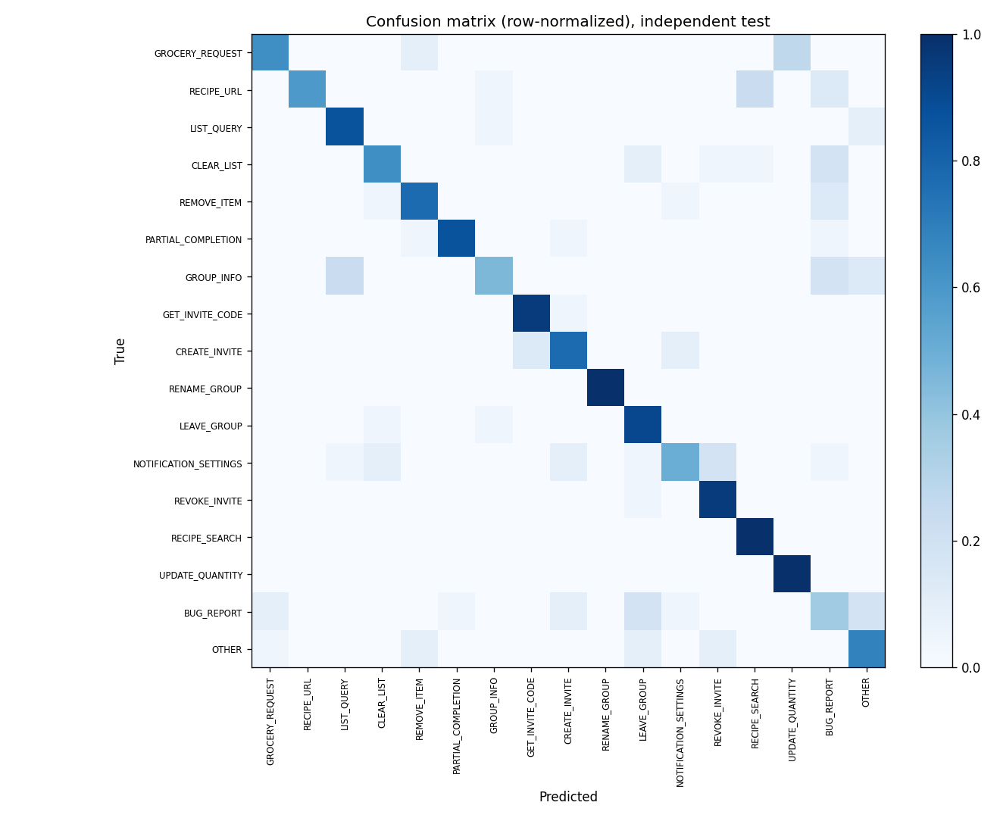

# Evaluation Report: AlephBERT Hebrew Intent Classifier

## Summary (single training run, seed 42)

- Accuracy: 0.7620
- Macro F1: 0.7559
- Weighted F1: 0.7559
- Test samples: 374 (22 per intent), held out at the seed level from training

## Baselines comparison

Every row is measured on the same 374-message test set. The column that
matters is cost: a zero-shot LLM charges per message, the fine-tune does not.

| Approach | Accuracy | Cost per 1,000 messages |
|----------|---------:|-------------------------|
| Random | 0.0668 | $0 |
| Majority class | 0.0588 | $0 |
| Keyword regex (hand-written) | 0.2487 | $0 |
| GPT-4o-mini zero-shot | 0.5722 | about $0.05 (gpt-4o-mini, Jan 2026 pricing) |
| AlephBERT fine-tune (this model) | 0.7620 | $0 |

The fine-tune is about 19 points more accurate than GPT-4o-mini
zero-shot, and once trained it costs nothing per message.

## Per-intent metrics

| Intent | Precision | Recall | F1 | Support |
|--------|----------:|-------:|---:|--------:|
| `GROCERY_REQUEST` | 0.824 | 0.636 | 0.718 | 22 |
| `RECIPE_URL` | 1.000 | 0.591 | 0.743 | 22 |
| `LIST_QUERY` | 0.760 | 0.864 | 0.809 | 22 |
| `CLEAR_LIST` | 0.778 | 0.636 | 0.700 | 22 |
| `REMOVE_ITEM` | 0.773 | 0.773 | 0.773 | 22 |
| `PARTIAL_COMPLETION` | 0.950 | 0.864 | 0.905 | 22 |
| `GROUP_INFO` | 0.769 | 0.455 | 0.571 | 22 |
| `GET_INVITE_CODE` | 0.875 | 0.955 | 0.913 | 22 |
| `CREATE_INVITE` | 0.739 | 0.773 | 0.756 | 22 |
| `RENAME_GROUP` | 1.000 | 1.000 | 1.000 | 22 |
| `LEAVE_GROUP` | 0.667 | 0.909 | 0.769 | 22 |
| `NOTIFICATION_SETTINGS` | 0.733 | 0.500 | 0.595 | 22 |
| `REVOKE_INVITE` | 0.750 | 0.955 | 0.840 | 22 |
| `RECIPE_SEARCH` | 0.786 | 1.000 | 0.880 | 22 |
| `UPDATE_QUANTITY` | 0.786 | 1.000 | 0.880 | 22 |
| `BUG_REPORT` | 0.333 | 0.364 | 0.348 | 22 |
| `OTHER` | 0.625 | 0.682 | 0.652 | 22 |

## Confusion matrix

## Methodology

- Train/test split: seed-level. For every intent, 2 seeds are held out before
  paraphrasing, and the test set contains only paraphrases of those held-out
  seeds, so no seed appears on both sides.
- Training data: LLM-generated paraphrases of Hebrew seed templates, plus a set
  of hand-authored examples added to cover phrasings the first version missed
  (for example "buy X" requests).
- Single training run (seed 42), evaluated on the held-out test set above.
